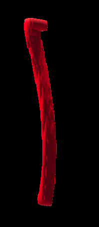

# ICA Segmentation Tool

This tool is designed for segmenting the Internal Carotid Artery (ICA) from Time-of-Flight (TOF) Magnetic Resonance (MR) images and calculating its diameter. It utilizes a 2D region growing algorithm with dynamic intensity thresholding to accurately determine the vessel area.

## Features

- Semi-automatic segmentation of ICA from TOF MR images
- 2D region growing algorithm with dynamic intensity thresholding
- Interactive GUI for user-guided segmentation
- Calculation of ICA diameter
- 3D visualization of the segmented ICA
- Preprocessing of raw TOF images

## Usage

The main function of this tool is `segment_ICA`. Here's how to use it:

```matlab
segment_ICA('path/to/image.nii', 'path/to/save/results/mySegmentation.csv')
```
#### This will open a GUI for the user to manually navigate the image and select the ICA for segmentation


#### Here you can manually select the function to the left which will segment the ICA


#### You can visualise the ICA after it has been identified



### Parameters:
- `filePath`: String specifying the full path to the .nii file containing the TOF MR image.
- `pathAndNameToSave`: String specifying the path and the subject-specific name under which the segmentation results (.csv file) will be saved.

### Output:
A .csv file is created at the specified location when the user presses the 'save' button in the GUI. This file contains summary statistics of the vessel segmentation, specifically the diameter estimates.

## Key Functions

### segment_ICA
The main function that provides an interface to segment vessels in TOF MR images. It uses a 2D region growth algorithm with dynamic intensity thresholding.

### illustrateICA
Visualizes the 3D structure of the Internal Carotid Artery (ICA) using isosurface plotting. It generates a 3D visualization of the ICA from a 3D MRI data set.

### regionGrowing2D
Performs region growing segmentation on a 2D image. It applies a region growing algorithm to segment an area in a 2D image starting from a user-defined seed point.

## Process

1. The raw TOF image is preprocessed before segmentation.
2. The user navigates the TOF image via a graphical interface.
3. The user manually selects the ICA.
4. The code handles the segmentation and calculation of the ICA diameter.

## Requirements

[List any dependencies or system requirements]

## Contributing

Contributions to improve the tool are welcome. Please feel free to submit a Pull Request.

## License

This project is licensed under the MIT License - see the [LICENSE](LICENSE) file for details.

## Contact

Author: Kristian Larsen
Date: 15/04/2024

Project Link: https://github.com/kristian1801/ica-segmentation-tool
